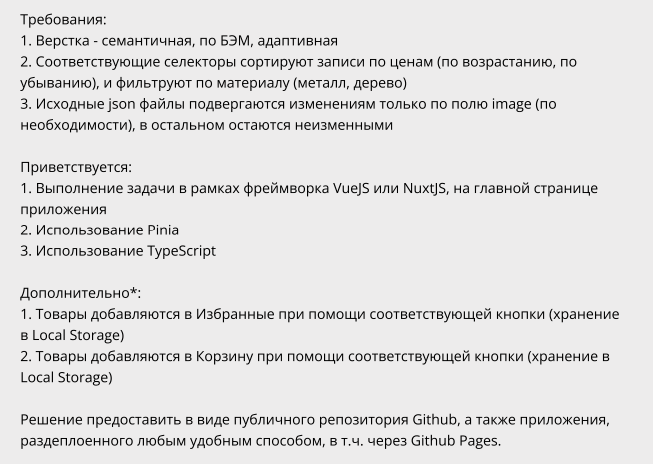

# Тестовое задание на должность "Frontend Developer / Vue.js (Middle)"

Техническое задание:



Рабочая версия приложение находится по ссылке: [Какая-то ссылка](https://google.com)


## Запуск приложения
Находясь внутри папки с проектом, установить зависимости
```
npm i
```

## Запуск проекта в режиме разработки
```
npm run dev
```
Далее перейти по ссылке [http://localhost:5173/](http://localhost:5173/)

## Сборка проекта
```
npm run build
```
Проект будет собран в папке ./dist
